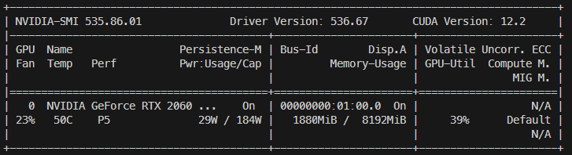

# Gai/Gen: Universal LLM Wrapper

Universal Multi-Modal Wrapper Library for LLM inferencing. The library provides a simplified and unified interface for seamless switching between multi-modal open source language models on a local machine and OpenAI APIs. This is intended for Developers who are targetting the use of multi-modal LLMs for both OpenAI API and local machine models.

## Table of Contents

-   [Gai/Gen: Universal LLM Wrapper](#gaigen-universal-llm-wrapper)
    -   [1. Introduction](#1-introduction)
    -   [2. Requirements](#2-requirements)
    -   [3. Credits](#3-credits)
    -   [4. Using Gai as a Library](#4-using-gai-as-a-library)
        -   [Configuration](#configuration)
        -   [API Key](#api-key)
        -   [Quick Start](#quick-start)
        -   [Examples](#examples)
    -   [5. Using Gai as a Service](#5-using-gai-as-a-service)
        -   [Endpoints](#endpoints)
        -   [Examples](#examples-1)
            -   [Text-to-Text Generation](/docs/TTT.ipynb)
            -   [Speech-to-Text Generation](/docs/STT.ipynb)
            -   [Text-to-Speech Generation](/docs/TTS.ipynb)
            -   [Image-to-Text Generation](/docs/ITT.ipynb)
            -   [Retrieval Augmented Generation](/docs/RAG.ipynb)

## 1. Introduction

The core object is called **Gaigen** - generative AI generator. The premise is for the code to run on as commonly available commodity hardware as possible. The main focus is on 7 billion parameters and below open source models. Gaigen is designed as singleton wrapper where only one model is loaded and cached into memory at any one time.

To avoid dependency conflicts, the wrappers are organised under the `gen` folder according to 5 mutually-exclusive categories:

-   ttt: Text-to-Text
-   tts: Text-to-Speech
-   stt: Speech-to-Text
-   itt: Image-to-Text
-   rag: Retrieval-Augmented Generation

## 2. Requirements

-   The instructions are tested mainly on:

    -   Windows 11 (22H2 Build 22621.3007) with WSL2 (5.12.133.1-microsoft-standard-WSL2)
    -   Ubuntu 20.04.2 LTS
    -   NVIDIA RTX 2060 GPU with 8GB VRAM. Run `nvidia-smi` to check if CUDA driver is installed.

    

    -   CUDA Toolkit 11.8 is required for the GPU accelerated models. Run `nvcc --version` to check if CUDA Toolkit is installed. Refer here https://gist.github.com/kakkoii1337/8a8d4d0bc71fa9c099a683d1601f219e if you need guidance.

## 3. Credits

This library is made possible by the generosity and hardwork of the following open source projects. You are highly encouraged to check out the original source and documentations.

TTT

-   [TheBloke](https://huggingface.co/TheBloke) for all the quantized models in the demo
-   [turboderp](https://github.com/turboderp/exllama) for ExLlama
-   Meta Team for the [LLaMa2](https://ai.meta.com/llama/) Model
-   HuggingFace team for the [Transformers](https://huggingface.co/docs/transformers/llm_tutorial) library and open source models
-   Mistral AI Team for [Mistral7B](https://mistral.ai/news/announcing-mistral-7b/) Model
-   Georgi Gerganov for [LLaMaCpp](https://github.com/ggerganov/llama.cpp)

ITT

-   Liu HaoTian for the [LLaVa](https://github.com/haotian-liu/LLaVA) Model and Library

TTS

-   [Coqui-AI](https://github.com/coqui-ai/TTS) for the xTTS Model

STT

-   [OpenAI](https://huggingface.co/openai/whisper-large-v3) for Open Sourcing Whisper v3

RAG

-   [chromadb](https://github.com/chroma-core/chroma) for AI-native open-source embedding database
-   [instructor](https://huggingface.co/hku-nlp/instructor-large) open source embedding model

## 4. Disclaimer

Maintainers of this repo are not responsible for the actions of third parties who use the models. Please consult an attorney before using models for commercial purposes.

## 5. License

This project is licensed under the [MIT](./LICENSE) License - see the LICENSE file for details.

---

## 6. Using Gai as a Library

Using Gai as a library requires you to install the right category of package but gives you more control over your interaction with Gaigen.
It is highly recommended that you install each category in separate virtual environments.

```bash
# Install library for text-to-text generation
pip install "gai-lib-gen[TTT]"

# Install library for text-to-speech generation
pip install "gai-lib-gen[TTS]"

# Install library for speech-to-text generation
pip install "gai-lib-gen[STT]"

# Install library for image-to-text generation (install LLaVA separately)
pip install "gai-lib-gen[ITT]"
git clone https://github.com/haotian-liu/LLaVA && cd LLaVA && pip install -e .

# Install library for retrieval-augmented generation
pip install "gai-lib[RAG]"
```

### 6.1 Configuration

**Step 1.** Create a `.gairc` file in your home directory. This file contains the default configurations for Gai.

```bash
{
    "app_dir": "~/gai"
}
```

**Step 2.** Create a `/gai` directory.

```bash
mkdir ~/gai
```

Copy `gai.json` from this repository into `~/gai`. This file contains the configurations for models and their respective loaders.

**Step 3.** Create `/gai/models` directory.

```bash
mkdir ~/gai/models
```

The final user directory structure looks like this:

```bash
home
├── gai
│   ├── gai.json
│   └── models
└── .gairc
```

### 6.2 Downloading Models

When downloading from huggingface model hub, it is recommended to use the [huggingface CLI](https://huggingface.co/docs/huggingface_hub/guides/download#download-from-the-cli).
You will need to install the CLI first.

```sh
pip install huggingface-hub
```

To download a model, run the following command:

```sh
huggingface-cli download <repo-name>/<model-name> --local-dir ~/gai/models/<model-name> --local-dir-use-symlinks False
```

**Example:** Downloading the main branch

```sh
huggingface-cli download TheBloke/Mistral-7B-Instruct-v0.1-GPTQ \
                --local-dir ~/gai/models/Mistral-7B-Instruct-v0.1-GPTQ \
                --local-dir-use-symlinks False
```

**Example:** Downloading 2 files

```sh
huggingface-cli download TheBloke/Mistral-7B-Instruct-v0.1-GGUF \
                mistral-7b-instruct-v0.1.Q4_K_M.gguf  \
                config.json \
                --local-dir ~/gai/models/Mistral-7B-Instruct-v0.1-GGUF \
                --local-dir-use-symlinks False
```

### 6.3 API Key

-   All API keys should be stored in a `.env` file in the root directory of the project.  
    For example,

    ```.env
    OPENAI_API_KEY=<--replace-with-your-api-key-->
    ANTHROPIC_API_KEY=<--replace-with-your-api-key-->
    ```

### 6.4 Quick Start

**Step 1. Install virtal environment and Gai**

The following example shows how to install the TTT category but the same steps are applicable to the other categories as well.

```bash
conda create -n TTT python=3.10.10 -y
conda activate TTT
pip install gai-lib-gen[TTT]
```

**Step 2. Setup OpenAI API Key.**

Save your OpenAI API key in the **.env** file in the root directory of your project.

```bash
OPENAI_API_KEY=<--replace-with-your-api-key-->
```

**Step 3. Run Inferencing on GPT4.**

Run Text-to-Text generation using OpenAI by loading `gpt-4` wrapper.

```python
from gai.gen import Gaigen
gen = Gaigen.GetInstance().load('gpt-4')

response = gen.create(messages=[{'role':'USER','content':'Tell me a one paragraph short story.'},{'role':'ASSISTANT','content':''}])
print(response)
```

**Step 4. Install Mistral7B.**

Download the model `Mistral-7B-Instruct-v0.1-GPTQ` into the `~/gai/models` folder.

```json
huggingface-cli download TheBloke/Mistral-7B-Instruct-v0.1-GPTQ \
                --local-dir ~/gai/models/Mistral-7B-Instruct-v0.1-GPTQ \
                --local-dir-use-symlinks False
```

**Step 5. Run Inferencing on Mistral**

Run Text-to-Text generation using Mistral7B by replacing `gpt-4` with `mistral7b-exllama`.

```python
from gai.gen import Gaigen
gen = Gaigen.GetInstance().load('mistral7b-exllama')

response = gen.create(messages=[{'role':'USER','content':'Tell me a one paragraph short story.'},{'role':'ASSISTANT','content':''}])
print(response)
```

## 7. Using Gai as a Service

Gai Service is meant to be a one-model-per-instance service. Unlike library, you cannot change the model during runtime.

The easiest to run Gai Service is to use a Docker container. You will need to download the models into ~/gai/models and map the volume to the container. You can then start up a container and post REST API calls to following endpoints.

### Endpoints

The following endpoints are only available for the category of models that you have installed.

**- Text-to-Text (TTT)**  
Endpoint: http://localhost:12031/gen/v1/chat/completions  
Method: POST  
Type: Body

| Name     | Type | Description                    | Default           |
| -------- | ---- | ------------------------------ | ----------------- |
| model    | str  | generator name                 | mistral7b-exllama |
| messages | list | See below                      |                   |
| stream   | bool | True, False                    | True              |
| ...      |      | Hyperparameters based on model |                   |

Note:

-   messages

```json
[
    { "role": "system", "content": system message },
    { "role": "user", "content": user message },
    { "role": "assistant", "content": AI message },
    ...
]
```

**- Text-to-Speech (TTS)**  
Endpoint: http://localhost:12031/gen/v1/audio/speech  
Method: POST  
Type: Body

| Name     | Type | Description                    | Default |
| -------- | ---- | ------------------------------ | ------- |
| model    | str  | generator name                 | xtts-2  |
| input    | str  | text to be spoken              |         |
| voice    | str  | voice id (speaker)             |         |
| language | file | language code                  | en      |
| stream   | bool | True, False                    | True    |
| ...      |      | Hyperparameters based on model |         |

**- Speech-to-Text**
Endpoint: http://localhost:12031/gen/v1/audio/transcriptions  
Method: POST  
Type: Multipart Form-Data

| Name  | Type | Description       | Default |
| ----- | ---- | ----------------- | ------- |
| model | str  | generator name    |         |
| file  | file | audio file object |         |

**- itt: Image-to-Text**
Endpoint: http://localhost:12031/gen/v1/vision/completions  
Method: POST
Type: Body
Parameters:

| Name     | Type | Description                    | Default |
| -------- | ---- | ------------------------------ | ------- |
| model    | str  | generator name                 |         |
| messages | list | see below                      |         |
| stream   | bool | True,False                     |         |
| ...      |      | Hyperparameters based on model |         |

Note:

-   messages format

```json
[
    {
        "role": "user",
        "content": [
            {"type": "text", "text": text},
            {
                "type": "image_url",
                "image_url": {
                    "url": 'data:image/jpeg;base64,.....',
                },
            },
        ],
        ...
    }
]
```

**- rag: Retrieval-Augmented Generation**

a) Endpoint: http://localhost:12031/gen/v1/rag/index_file  
Method: POST  
Type: Multipart Form-Data
Parameters:

| Name            | Type | Description                   | Default |
| --------------- | ---- | ----------------------------- | ------- |
| collection_name | str  | collection name in the store  |         |
| file            | file | the document to be indexed    |         |
| metadata        | dict | metadata tied to the document |         |

b) Endpoint: http://localhost:12031/gen/v1/rag/retrieve  
Method: POST  
Type: Body
Parameters:

| Name            | Type | Description                    | Default |
| --------------- | ---- | ------------------------------ | ------- |
| collection_name | str  | collection name in the store   |         |
| query_texts     | str  | query                          |         |
| n_results       | int  | no. of nearest result returned |         |

## 8. Examples

-   [Text-to-Text Generation (OpenAI GPT4 vs Open-Source Mistra7B)](/docs/TTT.ipynb)
-   [Speech-to-Text Generation (OpenAI Whisper vs Open-Source Whisper)](/docs/STT.ipynb)
-   [Text-to-Speech Generation (OpenAI Speech vs Open-Source xTTS)](/docs/TTS.ipynb)
-   [Image-to-Text Generation (OpenAI Vision vs Open-Source Llava)](/docs/ITT.ipynb)
-   [Retrieval Augmented Generation](/docs/RAG.ipynb)
